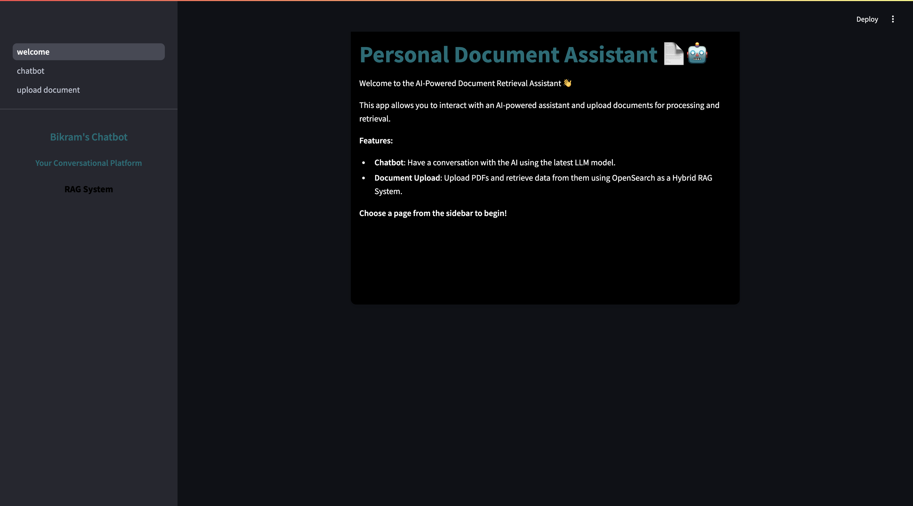

## About
The Private RAG System is a chatbot powered by Ollama's large language model (LLM) with retrieval-augmented generation (RAG). It processes information from uploaded PDFs, enabling interactive and context-aware conversations.

## Why
The primary motivation for developing this project was to ensure `privacy`. While OpenAI's chatbot offers similar functionality, I prefer not to upload sensitive information to online platforms. The Private RAG System is hosted locally, ensuring that your data remains entirely on your machine and never leaves your environment.
